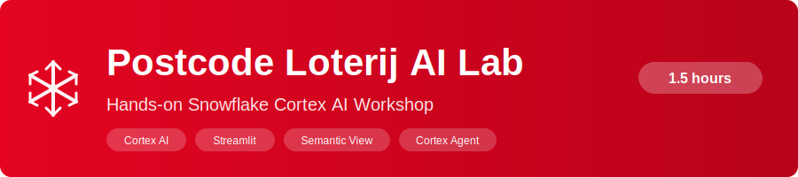

<p align="center">
  
</p>

A 1.5-hour hands-on workshop where you build an end-to-end AI analytics solution entirely within Snowflake — no external APIs, no additional tools, no data leaving your account.

## What You Will Build

| What | How |
|------|-----|
| **Synthetic lottery data** | 10,000 players, 24 months of draws, 30 charity partners |
| **AI-enriched player intelligence** | Sentiment analysis, segmentation, insights extraction, and personalized messages using Cortex AI |
| **Interactive Streamlit dashboard** | Branded with Postcode Loterij colors — player KPIs, charts, live winner draft with animation, and an AI chatbot |
| **Semantic View & Cortex Agent** | A business-friendly data model that powers a natural language AI agent |

## Architecture

```
                       SNOWFLAKE ACCOUNT
    ┌─────────────────────────────────────────────────────┐
    │                                                     │
    │  ┌─────────┐   Cortex AI    ┌──────────────┐       │
    │  │ RAW     │ ────────────>  │ ANALYTICS    │       │
    │  │ Schema  │  Sentiment     │ Schema       │       │
    │  │         │  Classify      │              │       │
    │  │ PLAYERS │  Extract       │ PLAYER_      │       │
    │  │ DRAWS   │                │ INTELLIGENCE │       │
    │  │ TICKETS │                │              │       │
    │  │ CHARITIES│               │ Views        │       │
    │  │ DONATIONS│               └──────┬───────┘       │
    │  └─────────┘                       │               │
    │                          ┌─────────▼──────────┐    │
    │                          │ SEMANTIC VIEW       │    │
    │                          │ Business data model │    │
    │                          └─────────┬──────────┘    │
    │                    ┌───────────────┼────────┐      │
    │            ┌───────▼────────┐  ┌───▼──────┐ │      │
    │            │ STREAMLIT APP  │  │ CORTEX   │ │      │
    │            │ Dashboard      │  │ AGENT    │ │      │
    │            │ Winner Draft   │  │ NL → SQL │ │      │
    │            │ AI Chatbot     │  └──────────┘ │      │
    │            └────────────────┘               │      │
    │                                             │      │
    └─────────────────────────────────────────────────────┘
```

## Snowflake Features Covered

| Feature | What it does | Module |
|---------|-------------|--------|
| **GENERATOR + UNIFORM + CHR** | Generate realistic synthetic data entirely in SQL | 1 |
| **CORTEX.SENTIMENT** | Score player feedback from -1 (negative) to +1 (positive) | 2 |
| **CORTEX.AI_CLASSIFY** | Categorize players into segments (High-Value Loyal, At-Risk, etc.) | 2 |
| **CORTEX.AI_EXTRACT** | Pull structured fields (interests, complaints, preferences) from free-text feedback | 2 |
| **CORTEX.SUMMARIZE** | Generate concise summaries of player feedback | 2 |
| **CORTEX.COMPLETE** | Generate personalized retention messages using an LLM | 2 |
| **Streamlit in Snowflake** | Build interactive dashboards without leaving Snowflake | 3 |
| **Semantic View** | Define business meaning of tables (dimensions, facts, metrics) for AI | 5 |
| **Cortex Agent** | AI orchestrator that converts natural language to SQL via your Semantic View | 5 |

## Prerequisites

- A Snowflake account with **ACCOUNTADMIN** access
- A web browser (everything runs inside Snowflake — no local installs needed)

## Lab Agenda

| Module | Topic | Duration |
|--------|-------|----------|
| 0 | Environment Setup | 5 min |
| 1 | Foundation: Create Database & Synthetic Data | 15 min |
| 2 | AI Enrichment with Cortex AI Functions | 25 min |
| 3 | Build Streamlit Dashboard | 20 min |
| 4 | Explore & Interact with the App | 10 min |
| 5 | Semantic View & Cortex Agent | 15 min |
| **Bonus** | **Cortex Code Challenge** | **15 min** |

## Getting Started

1. **Open the [Lab Guide](lab_guide.md)** — this is the step-by-step walkthrough for the entire workshop
2. Start at **Module 0** to set up your environment
3. Follow each module in order — every step explains *what* you're doing and *why*

## Repository Contents

```
postcode_loterij_lab/
├── README.md                 ← You are here
├── lab_guide.md              ← Full step-by-step lab guide (start here)
├── assets/
│   ├── banner.svg            ← GitHub README banner
│   ├── border.svg            ← Red-to-blue gradient bar
│   └── divider.svg           ← Diamond section divider
├── scripts/
│   ├── 01_setup.sql          ← Module 1: Database, tables, synthetic data
│   └── 02_ai_enrichment.sql  ← Module 2: Cortex AI enrichment pipeline
├── streamlit_app.py          ← Module 3: Branded Streamlit dashboard
└── environment.yml           ← Streamlit dependency pinning
```

## About Postcode Loterij

The [Nationale Postcode Loterij](https://www.postcodeloterij.nl/) is one of the largest charity lotteries in the Netherlands. Players subscribe with their postcode, and 40% of ticket revenue goes to charity partners working on people and planet. This lab uses synthetic data inspired by that model.
